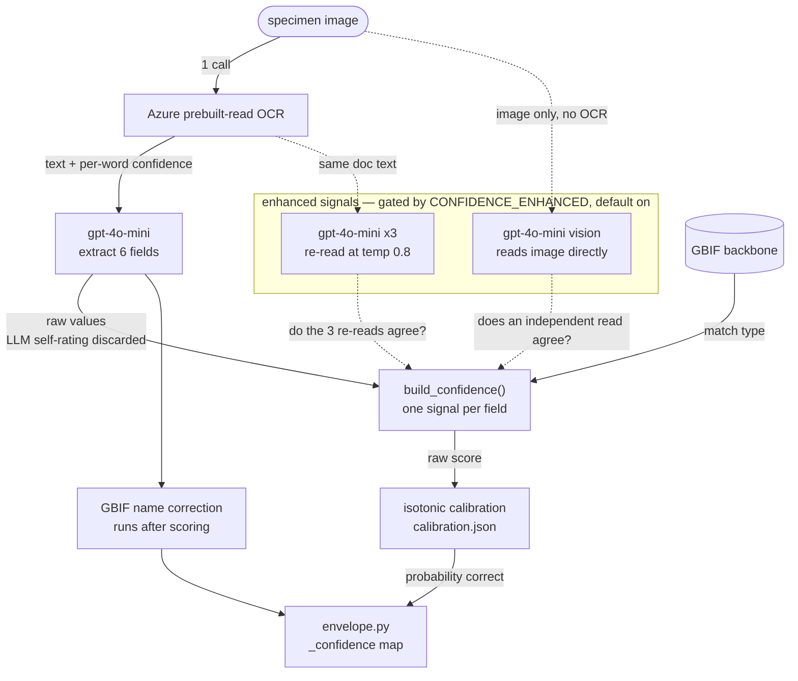

# Azure pipeline: the confidence score

The Azure pipeline returns six Darwin Core fields per specimen plus a confidence
score for five of them, so reviewers can auto-accept the values the pipeline is
sure about and hand-check the rest.

This describes how that score is computed, how well it works, and how to
regenerate it. Scope is the Azure + gpt-4o-mini pipeline; the Anthropic pipeline
(`transcription/claude_sonnet.py`) has no confidence scoring.


## The idea

Confidence comes from a **reference check**: compare the extracted value either
against an external authority (the GBIF taxonomic backbone, a place gazetteer, a
known-collector list) or against an independent second read of the same specimen.
Every per-field signal is one of those two shapes.

Two things that look like confidence are deliberately not used. The LLM's own
self-rating is discarded (`run_doc_intell_pipeline` does `data.pop("confidence")`)
— it is cheap and does not predict correctness. OCR grounding, meaning "did this
value appear in the OCR text", is only a fallback, because the common failure is
misreading text that *is* on the label rather than inventing text that isn't.


## Where it sits



Two things in that flow are easy to break when editing:

**Confidence is scored on the raw read, before the GBIF name correction.** The
correction rewrites a misread `scientificName` into the accepted species. Scoring
after it would give every corrected name a perfect score and hide the flag.

**The enhanced signals are shared, not per-field.** One self-consistency batch and
one vision call serve all five fields, so the cost decision is per specimen.

Six API calls per specimen with enhanced on: 1 Azure OCR, 1 extraction, 3
self-consistency re-reads, 1 vision read. That is **$4.50 per 1,000 specimens**,
against **$2.00 per 1,000** with enhanced off. See `docs/cost-projection.md`.


## Per-field signals

Scorers live in `transcription/confidence.py`. Each returns `None` for an empty or
`UNKNOWN` value, which the envelope then drops.

| Field | Signal | Fallback without the enhanced signals |
|---|---|---|
| `scientificName` | GBIF backbone match type (`EXACT`→1.0, `FUZZY`→0.5, else 0.0) × string agreement with the vision read | Match type alone, or OCR grounding if GBIF is unreachable |
| `eventDate` | Mean of self-consistency agreement across K=3 re-reads and agreement with the vision read | Date validity: parses, year 1600–present, year present in OCR |
| `recordedBy` | Mean of best fuzzy match to the known-collector set and agreement with the vision read | Collector-set match alone |
| `barcode` | Fraction of the K re-reads reproducing the same catalog digits, ignoring leading zeros | Longest-digit-run ratio against the OCR words |
| `location` | Count of recognized places (town/county/state) capped at 3, halved if the vision read parses a different state | Same count, no vision penalty |
| `institutionCode` | Not scored — always `None` | — |

Design details worth knowing before changing them:

- **`eventDate` has two hard overrides.** A year outside 1600–present forces 0.0
  regardless of agreement, and a vision read disagreeing on the year halves the
  score. Three re-reads can agree on the same misread, so agreement alone is not
  enough.
- **`scientificName` multiplies, `recordedBy` averages.** GBIF match type
  saturates — most reads come back `EXACT` — so multiplying by vision agreement is
  what separates right from wrong. For `recordedBy`, a collector genuinely absent
  from the gazetteer would be driven to zero by multiplication even on a perfect
  read, so the two signals are averaged and either alone is accepted.
- **`location` uses vision as a penalty, not as the score.** Two reads agreeing on
  the state says nothing about the locality and county, which carry most of the
  accuracy; the graded place count is the score and a contradicting state halves it.
- **`location` compares state codes, not strings**, so `NH`, `New Hampshire`, and
  `N.H.` are equal. `_state_code` scans components right to left, so a town named
  after a state (`Washington, Litchfield, Connecticut`) resolves to `CT`.
- **`institutionCode` is unscored** — no trustworthy ground truth, and it is not in
  the middleware contract.

The shared text helpers (`_tokenize`, `_digits`, `_ratio`, `match_field`) are also
imported by the `nbs/` eval scripts, so changing them moves every historical eval
number. `_MATCH_THRESHOLD = 0.8` is the similarity floor for calling a field token
grounded in an OCR word; `_MIN_TOKEN_LEN = 2` drops initials and `var`.


## The enhanced gate

`doc_intelligence._enhanced_enabled()` reads `CONFIDENCE_ENHANCED` and defaults to
**on**. Set `0`, `false`, `no`, or `off` to disable, which drops the two paid
signals: `eventDate` falls back to date validity, `recordedBy` to the gazetteer,
and the other three keep their free signals.

Leave it on unless you have a reason. Without it, discrimination on `eventDate`,
`recordedBy`, and `barcode` falls to roughly a third of what the table below shows
— too weak to route review on.

`CONFIDENCE_DETAIL` switches per-field output from a float to
`{"score", "coverage", "raw", "ocr_read"}`, useful when debugging one field. The
envelope collapses it back to a single float.


## Calibration

Raw signals are on arbitrary scales — `location` emits multiples of a third,
`scientificName` only 0.0 / 0.5 / 1.0 before the vision multiply — so a raw 0.8 did
not mean "80% likely correct".

`transcription/calibration.json` holds per-field isotonic knots fit by
`nbs/fit_calibration.py`. `_apply_calibration` interpolates piecewise-linearly
between them and clamps outside the ends.

Isotonic regression is monotonic, so **calibration never changes the ranking of two
values, only the numbers**. It exists so a shipped 0.8 means roughly 80% correct.
Maps exist for `scientificName`, `eventDate`, `barcode`, and `location`;
`recordedBy` is already well-calibrated and passes through, as does everything if
`calibration.json` is missing.


## Output shape

`transcription/envelope.py` adapts the result to the Herbaria portal middleware's
flat Darwin Core object plus a parallel `_confidence` map.

- `location` ships as DWC `locality`, `barcode` as `catalogNumber`.
- Only the five scored fields appear in `_confidence`. A field absent from the map
  means "confidence unavailable" and the UI shows no score bar — which is why
  scorers return `None` rather than 0.0 for an empty value. 0.0 would render as
  "we are confident this is wrong".
- Values are clamped to [0, 1]; `None` and `NaN` are dropped.
- The pre-correction name, the GBIF match type, and the structured location parts
  ride in `_meta`, leaving the flat contract unchanged.


## How well it works

Measured on 532 cached GBIF-labeled specimens. `rho` is Spearman correlation of
confidence against correctness — how well the score ranks right above wrong.
Auto-accept is what happens at a 0.90 cutoff: the share of values skipped, and the
share of *those* that are actually wrong.

| Field | rho | auto-accepted at ≥0.90 | wrong among them |
|---|---:|---:|---:|
| `scientificName` | +0.48 | 41% | 15.5% |
| `location` | +0.47 | — | — |
| `barcode` | +0.41 | 90% | 9.8% |
| `recordedBy` | +0.39 | 23% | 10.3% |
| `eventDate` | +0.36 | 35% | 8.8% |

Across the four fields with binary correctness, a 0.90 cutoff auto-accepts about
47% of values and lets through errors on about 5% of all fields. On a 1.5M-specimen
corpus at 10 seconds of review per field, that is roughly 7,900 reviewer-hours
saved, or 4.5 person-years.

Raising the cutoff above 0.90 buys little: coverage drops while the missed-error
rate stays flat or worsens slightly, because calibration compresses the top of the
range. `barcode` sits at 90% coverage at every cutoff — its signal is the fraction
of K re-reads agreeing, which is nearly always 1.0 or 0.0, so no cutoff in this
range separates anything.

Regenerate any of these with `nbs/roi_pareto_eval.py` and
`nbs/confidence_threshold_table.py`; both read the caches and cost nothing.


## Limitations

**`location` depends on `geonamescache`.** Without it, `_state_code` returns `None`
for everything and the field degrades to OCR grounding, which is anti-correlated
with accuracy. The module emits a one-shot `RuntimeWarning`, but it is easy to miss
in a batch run — if `location` confidence clusters hard at 1.0, check the import
first. Install the full requirements, not individual packages.

**`location` calibration targets a different metric than the eval.**
`nbs/fit_calibration.py` labels a location correct when the state matches, while
`nbs/roi_pareto_eval.py` scores admin token-recall across locality, county, and
state. The calibrated `location` probability therefore answers "is the state
right". Reconcile before quoting it externally.

**The evidence is partly circular.** Ground truth comes from GBIF and
`scientificName`'s strongest signal is a GBIF backbone match, so that field is
partly graded by its own source. The planned fix is the hand-labelled non-GBIF set
in `docs/cost-projection.md`.

**The self-consistency cache is K=5, the runtime uses K=3.** Evals reading the cache
see slightly steadier agreement than production produces.

**`nbs/confidence_eval.py` defaults to the 50-specimen New England set**, so its n
is much smaller than the other evals. Use `roi_pareto_eval.py` for headline numbers.


## Runbook

Run from the repository root. Credentials come from `transcription/.env`
(`AZURE_DOCUMENT_KEY`, `OPENAI_API_KEY`).

Install the full dependency set — a partial install degrades the `location` signal:

```bash
python -m pip install -r transcription/requirements-doc-int.txt
python -c "import geonamescache, azure.ai.formrecognizer; print('deps ok')"
```

Rebuild the eval set. Free, and idempotent:

```bash
python nbs/gbif_refetch_occids.py                 # images + ground truth
python nbs/gbif_refetch_occids.py --skip-images   # ground truth only
```

Rebuild the caches, in this order. These cost API money; each skips work already
cached:

```bash
python nbs/ocr_cache.py --pipeline azure --image-dir transcription/data/gbif-ne-500
python nbs/self_consistency_cache.py --pipeline azure --k 5 --temp 0.8
python nbs/vision_agreement_test.py --n 500     # also fills the vision cache
```

Re-fit calibration and re-run the evals — free, cache-only:

```bash
python nbs/fit_calibration.py                   # writes transcription/calibration.json
python nbs/roi_pareto_eval.py --gt-dir transcription/data/gbif-ne-500
python nbs/confidence_threshold_table.py --gt-dir transcription/data/gbif-ne-500
```

After changing a signal in `confidence.py`: rebuild caches only if the *inputs*
changed, then re-fit calibration, then re-run the evals. Skipping the re-fit leaves
calibration mapping from a scale that no longer exists.


## File map

| Path | Role |
|---|---|
| `transcription/confidence.py` | Scorers, calibration application, `build_confidence` |
| `transcription/doc_intelligence.py` | Orchestration, enhanced gate, vision and self-consistency callers, GBIF correction |
| `transcription/envelope.py` | Adapter to the middleware DWC envelope |
| `transcription/calibration.json` | Fitted isotonic knots |
| `transcription/results/ocr_cache/azure/` | Cached OCR words and extraction, per occid |
| `transcription/results/self_consistency_cache/azure/` | Cached K re-reads |
| `transcription/results/vision_cache/` | Cached independent vision reads |
| `transcription/results/gbif_taxon_full.json` | GBIF backbone lookups, on-disk memo |
| `nbs/fit_calibration.py` | Fits `calibration.json` |
| `nbs/roi_pareto_eval.py` | Per-field rho, missed-error, reviewer-hours |
| `nbs/confidence_threshold_table.py` | Coverage and missed-error by cutoff |
| `nbs/gbif_refetch_occids.py` | Rebuilds the eval set by occurrence key |

The caches and `transcription/data/gbif-ne-500/` are gitignored — large and
per-machine. Regenerate them with the runbook rather than expecting them in a fresh
clone.
