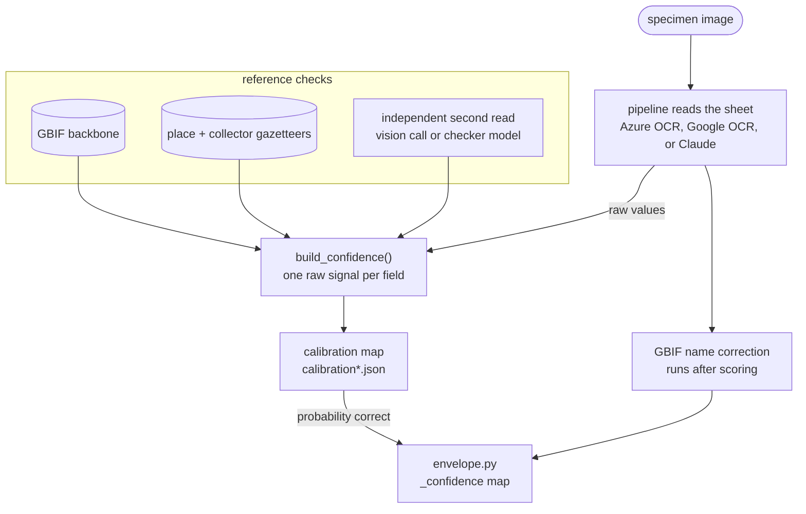

# Confidence

Every pipeline returns six Darwin Core fields plus a `_confidence` map: a number per
field saying how likely that value is to be correct. A reviewer only opens the low
ones. Without it a human checks everything and the automation saves nothing.

The mechanism is shared across all three pipelines. What differs per pipeline is
which signals are available, and that is the table at the bottom.


## How a score is produced

Confidence comes from a **reference check**: compare the extracted value either
against an external authority (the GBIF taxonomic backbone, a place gazetteer, a
known-collector list) or against an independent second read of the same specimen.
Every signal is one of those two shapes.

Two things that look like confidence are deliberately not used. The model's own
self-rating is discarded — it is cheap and does not predict correctness. OCR
grounding ("did this value appear in the OCR text") is only a fallback, because the
common failure is misreading text that *is* on the label rather than inventing text
that isn't.



**Confidence is scored on the raw read, before the GBIF name correction.** The
correction rewrites a misread `scientificName` into the accepted species. Scoring
after it would give every corrected name a perfect score and hide the flag.


## Calibration

Raw signals are on arbitrary scales — one field emits multiples of a third, another
only 0.0 / 0.5 / 1.0 — so a raw 0.8 does not mean "80% likely correct". Each pipeline
has an isotonic map that converts its raw signal to a probability. The map is
monotonic, so it never reorders two values; it only makes the numbers mean something.

Maps do not transfer between pipelines. The same raw score means a different
probability for a different reader, which is why there are three files.

**The maps are deliberately conservative.** Each level ships the figure we are 90%
confident the data supports, not the observed average. Where a signal was right 43%
of the time on 100 specimens, it ships 0.37. They under-state rather than over-state,
so a stated 0.8 is worth *at least* 80%.

That choice costs coverage — more fields go to a human than strictly need to — and
it is deliberate. Confidence varies by collection: the same field reads 39% correct
on amateur handwritten labels and 75% on printed labels from large herbaria. A map
that is right on average would over-state on the harder collections, and telling a
reviewer a field is safe when it isn't puts the error in the database silently.

Verified against 148 specimens never used for fitting: nothing over-states on any
field, on any pipeline.

Rebuild every map with:

```
python nbs/fit_all_calibration.py
```

The per-pipeline fitters replace their whole map file, so the order matters and that
script encodes it. Never fit on the holdout set — it is only useful while untouched.


## What each pipeline has

| Field | Azure | Google | Anthropic |
|---|---|---|---|
| `scientificName` | GBIF match + vision | GBIF match + vision | GBIF match |
| `location` | gazetteer + vision state check | gazetteer + vision | gazetteer |
| `eventDate` | self-consistency + vision | vision agreement | checker model |
| `recordedBy` | collector list + vision | collector list + vision | collector list + checker |
| `barcode` | digit-run + self-consistency | digit-run structure | agreement with the Azure read |

All five fields are calibrated on all three pipelines.

| | Azure | Google | Anthropic |
|---|---:|---:|---:|
| Mean AUC (0.50 = coin flip) | **0.777** | 0.726 | 0.764 |
| Extra calls for confidence | 4 | 1 | 3 |
| Cost per 1,000, with confidence | $4.50 | **$3.00** | $19.90 |

Azure ranks right above wrong best; Anthropic's numbers are the most honest, and it
is the least affected when the specimens are unlike the ones the maps were fitted on.

`CONFIDENCE_ENHANCED=0` turns off the paid signals on any pipeline. Cheaper, fewer
fields scored.


## Choosing a review threshold

There is no single right cutoff. Because the maps are conservative, raising it
excludes whole fields rather than trading coverage for precision.

| Cutoff | Azure | Google | Anthropic |
|---|---|---|---|
| 0.80 | 49% skipped, 93% right | 49% skipped, 91% right | **67% skipped, 92% right** |
| 0.85 | 46% skipped, 94% right | 61% skipped, 94% right | 56% skipped, 93% right |
| 0.90 | 31% skipped, 93% right | 29% skipped, 93% right | 50% skipped, 94% right |

**0.80–0.85 is the useful range.** At 0.90 only two of Azure's five fields can reach
the cutoff at all.

Per-field figures at every cutoff are in `transcription/threshold_table.json`, rebuilt
by `nbs/build_threshold_table.py`. `GET /pipelines` returns the ceiling per field, so
a client can show "always reviewed" rather than an empty result. The standalone tool
at `/tool` has a slider that shows this live.


## Limitations

**Confidence varies by collection.** Measured: 39% versus 75% accuracy on the same
field, depending only on which herbaria the specimens came from. The conservative
maps make that safe rather than solved. The real fix is fitting per collection, which
needs labelled specimens from it — see the review log below.

**The evidence is partly circular.** Ground truth comes from GBIF and
`scientificName`'s strongest signal is a GBIF backbone match, so that field is partly
graded by its own source. A 40-specimen hand-labelled check found no pipeline errors
among the disagreements, but a non-expert labels cursive species names at about 11%
error — too noisy to confirm the numbers. Closing it needs a botanist on that column.

**The held-out set is easier than the training data.** It was drawn from larger
herbaria with printed labels, so it verifies that nothing over-states but understates
how much review the tool can save. A redraw matching the training mix is pending.

**Nothing learns yet.** The tool at `/tool` logs reviewer corrections to
`reviews.jsonl`, and each row is a labelled specimen from that collection — the input
a per-collection map would need. Nothing reads that log yet, and roughly 150–300
reviews would be needed before a refit means anything.
